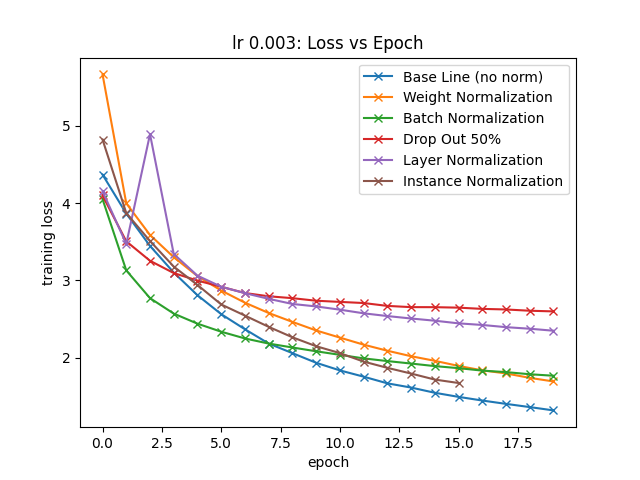
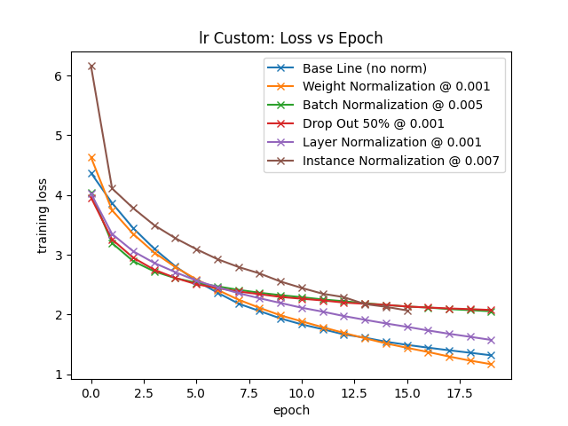
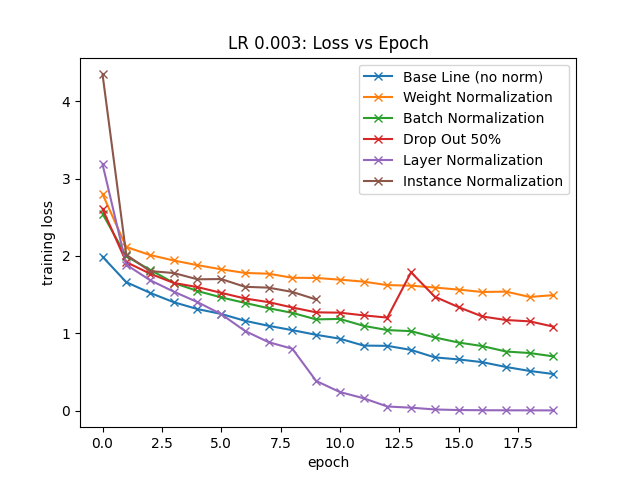
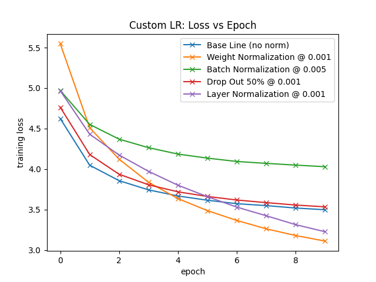
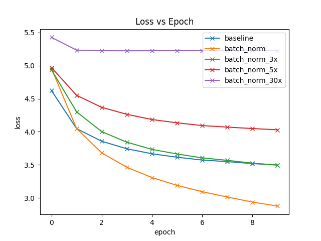

Normalization Methods - Week 5 Group 1
-

Papers covered in our repo:

- Dropout: A Simple Way to Prevent Neural Networks from Overfitting, Srivastava, Hinton, Krizhevsky, Sutskever, Salakhutdinov; 2014	
- Batch Normalization: Accelerating Deep Network Training by Reducing Internal Covariate Shift, Ioffe, Szegedy; 2015	
- Weight Normalization: A Simple Reparameterization to Accelerate Training of Deep Neural Networks, Salimans, Kingma; 2016	
- Layer Normalization, Ba, Kiros, Hinton; 2016	
- Instance Normalization: The Missing Ingredient for Fast Stylization, Ulyanov, Vedaldi, Lempitsky; 2016	

### Datasets

- CIFAR 100
- STL10
- Tiny ImageNet

### Architectures

Our main architecture all normalizations were tested on was a ResNet backbone, however, we also
tested Weight Normalization on ConvPool-CNN-C (a model that was explored in the paper). The last
model we tried was a custom integration of the Visual Transformer ViT.

- Resnet
- ViT
- ConvPool-CNN-C

# Main Experiments 

### CIFAR 100 Task Performance per Normalization

Description:
    CIFAR 100 is a dataset with 100 classes, each image is a 32x32 image, and the goal is to classify 
    the images into their correct categories.

Models:
    We used CIFAR on all of our models because of its low resolution and smaller size, its easy to quickly
iterate on it.

Setup:
    For all models we followed these hyper-parameters

- Batch size of 64
- 20 epochs
- learning rate of 0.003 and one Custom LR run (paper owner chose a different LR)
    

| Normalization | Test Acc @ 0.003 | Test Acc @ Custom |
| --- | --- | --- |
| Weight Normalization | 44.1 | 46.52 |
| Batch Normalization | 44.09 | 41.36 |
| Drop Out | 27.3 | 38.02 |
| Layer Normalization | 31.74 | 37.04 |
| Instance Normalization | | |

### STL10 Task Performance per Normalization

Description:
    STL10 has 10 classes with images of size 96x96.  You have a very small pool of training images, which
is really meant for training unsupervised algorithms but it also is helpful for testing generalization.

Models:
    STL10 was used on our Resnet Backbone for our experiments

Setup:
    For all models we followed these hyper-parameters

- Batch size of 64
- 20 epochs
- learning rate of 0.003

| Normalization | Test Acc @ 0.003 | Test Acc @ Custom |
| --- | --- | --- |
| Weight Normalization | 43.3 | 46.6 |
| Batch Normalization | 56.8875 | 60.1 |
| Drop Out | 43.89 | 52.08 |
| Layer Normalization | 46.75 | 57.0 |
| Instance Normalization | | |

### Tiny ImageNet Task Performance per Normalization

Description:
    Tiny ImageNet is a small version of ImageNet, it has 100,000 images with 200 classes (500 images per class).
The images are of size 64 x 64.  For testing each image class has 50 test images.

Models:
    Tiny ImageNet was used on our Resnet Backbone for our experiments

Setup:
    For all models we followed these hyper-parameters

- Batch size of 64
- 10 epochs (it took too long to train for longer epochs)
- learning rate of 0.003 and one Custom LR run (paper owner chose a different LR)

| Normalization | Test Acc @ 0.003 | Test Acc @ Custom |
| --- | --- | --- |
| Weight Normalization | 26.78 | 28.13 |
| Batch Normalization | 23.38 | 14.5 |
| Drop Out | 13.72 | 14.39 |
| Layer Normalization | 15.62 | 15.68 |
| Instance Normalization | | |

### ViT Tests

Description: To test a different architecture other than
Conv Nets, we ran our normalization layers on a ViT network
across all 3 datasets.

Setup:

- Batch size of 64
- 20 epochs (10 for Tiny ImageNet)
- Learning rate of 0.001

Test accuracies:

| Normalization | CIFAR 100 | STL10 | Tiny ImageNet |
| --- | --- | --- | --- |
| Weight Normalization | 5.02 | 10.6 | 0.79 |
| Batch Normalization | 27.5 | 42.18 | 14.65 |
| Drop Out | 26.07 | 43.29 | 12.96 |
| Layer Normalization | 28.34 | 42.14 | 13.71 |
| Instance Normalization | 30.32 | 43.6 | 13.25 |

# Other Experiments

Batch Normalization Experiments
-

These experiments compare a baseline CNN model to the same model with batch normalization. We implement batch normalization using `torch.nn.BatchNorm2d`. As in the paper, we compare three variants of batch normalization: one with a default LR of 0.001, and two variants with a 5x and 30x increase in learning rate.

### Results

The batch normalized model with default learning rate of 0.001 gets the highest test accuracy across all three datasets.

### Training Loss Per Dataset

||
|:--:|
|CIFAR-100|
 

||
|:--:|
|STL-10|
 

||
|:--:|
|TinyImageNet|
 

### Test Accuracy After 10 Epochs
| |**CIFAR-100 Test Accuracy**|**STL-10 Test Accuracy**|**TinyImageNet Test Accuracy**|
|:-----:|:-----:|:-----:|:-----:|
|baseline|37.83|59.975|20.13|
|batch\_norm|51.23|62.175|31.89|
|batch\_norm\_5x|36.43|60.1|14.5|
|batch\_norm\_30x|1.76|40.5875|0.82|

Weight Normalization Experiments
-

### Implementation Details

I tested Weight Normalization on PyTorches native implementation as well as my own.  

Weight Normalization is implemented as a wrapper to a layer, it reparameterizes the weight matrix
every forward call using two new parameters, g and v.  v is really v / ||v|| during initialization. 

In order to make Weight Norm work with existing models, the best way to implement it is to 
store parameters v and g in the layer, but use them to recompute the W weight matrix for that layer
anytime the forward() method is called.

### CIFAR100 Test Results

Setup:

- Learning rate of 0.001
- 40 Epochs
- Batch Size of 64

Models:

- Resnet Backbone
- ConvPool CNN C (from the paper)

### Interpretation of results

In all my experiments, weight normalization prevented the model from overfitting and allowed the model
to converge at better test accuracies. 

Interestingly, I expected my implementation to match PyTorches, however, there were significant differences
in the results shown in the graph.  PyTorches implementation has a few slight differences in their forward
call, but they also do not divide the weight matrix by g when initializing the v matrix.  

Although this is probably harmless, I experimented with this myself but the test results were inconclusive, 
so the discrepancy is an unsolved oddity. (one potential explanation that I did not have time to explore is 
that pytorch uses the L2 norm for the weight calculation, I used L1)