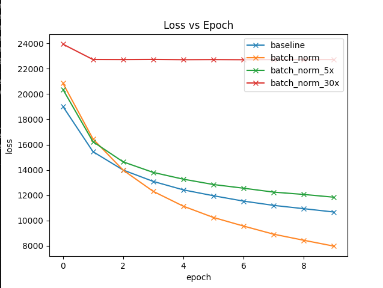
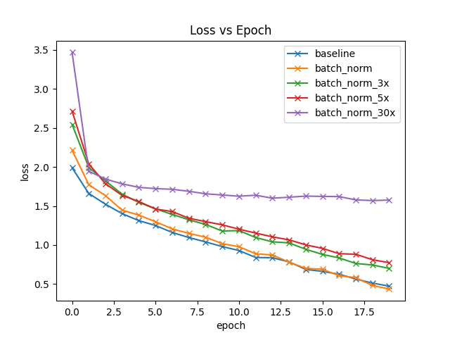
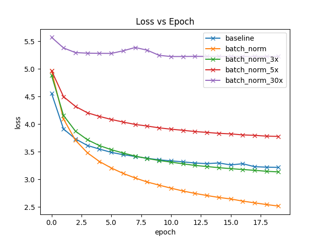

# Batch Normalization Experiments

These experiments compare a baseline CNN model to the same model with batch normalization. We implement batch normalization using `torch.nn.BatchNorm2d`. As in the paper, we compare three variants of batch normalization: one with a default LR of 0.001, and two variants with a 5x and 30x increase in learning rate.

# Results

The batch normalized model with default learning rate of 0.001 gets the highest test accuracy across all three datasets.

# Training Loss Per Dataset

<em>CIFAR-100</em>
<em>STL-10</em>
<em>TinyImageNet</em>

# Test Accuracy After 10 Epochs
| |**CIFAR-100 Test Accuracy**|**STL-10 Test Accuracy**|**TinyImageNet Test Accuracy**|
|:-----:|:-----:|:-----:|:-----:|
|baseline|37.83|59.975|20.13|
|batch\_norm|51.23|62.175|31.89|
|batch\_norm\_5x|36.43|60.1|14.5|
|batch\_norm\_30x|1.76|40.5875|0.82|
