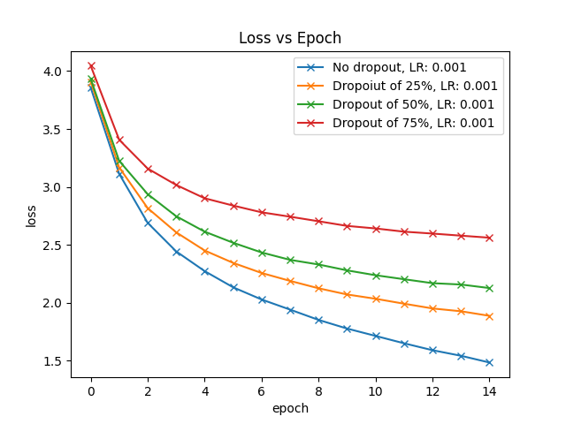
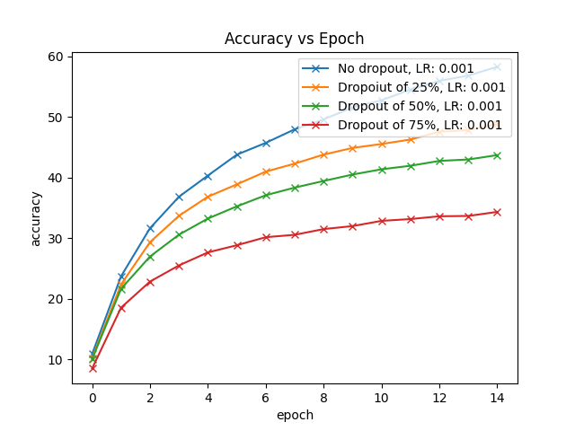
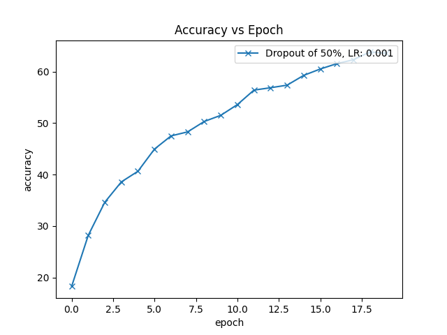
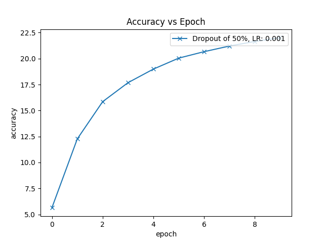
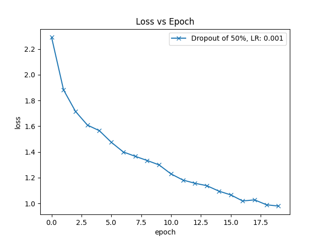
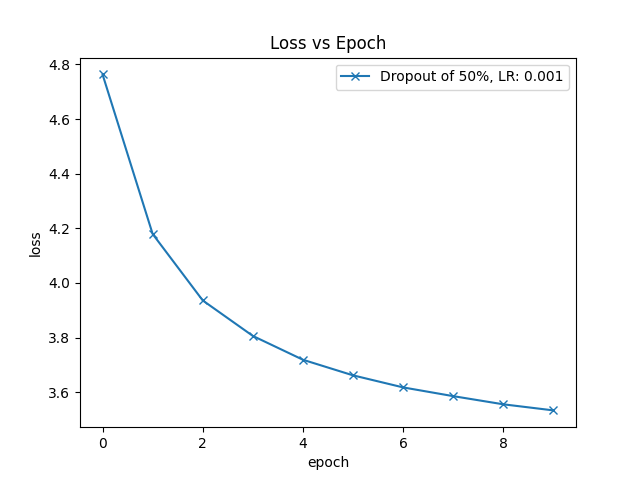

## Dropout Experiments
One of the most used techniques to prevent overfitting on a neural network is dropout. The method consists of including a probability "p" of existing or not to each node of each layer on the network. Using a p value of 0.5 for dropout is usually the standard for networks.\
For this project, we tested dropout through a CNN implementation in Pytorch, training on CIFAR100, assigning dropout probabilities of 0 (no dropout), 0.25, 0.50, and 0.75, as well as two different learning rates: 0.01, 0.001.\
The dropout method was implemented through Pytorch's built in `nn.Dropout()` module, which takes in a single p (probability) parameter.

The model with no dropout and learning rate of 0.001 resulted in the highest training accuracy, at 14 epochs.\
The models with a learning rate = 0.01 resulted in really high loss results. They were taken off the result plots. Our understanding is that the LR was simply too large.\
Although 'no dropout' resulted in the best test accuracy, dropout of 50% was chosen for the comparison to other normalization methods, as it is the standard value used in most models.

### CIFAR100 Dropout Experiment

### STL10 and TinyImageNet Experiment
On the remaining two datasets, dropout was set to 0.5, and learning rate was tested at 0.001 (best performing), and 0.003 (normalizations comparison). The best performing results (LR = 0.001) are shown below (LR = 0.003 results are shown in the normalizations comparison section): \

Dropout Training Accuracy on STL10                                                  |  Dropout Training Accuracy on TinyImageNet
:----------------------------------------------------------------------------------:|:----------------------------------------------------------------------------------:
   |  
Dropout Training Loss on STL10                                                      |  Dropout Training Loss on TinyImageNet
      |  
